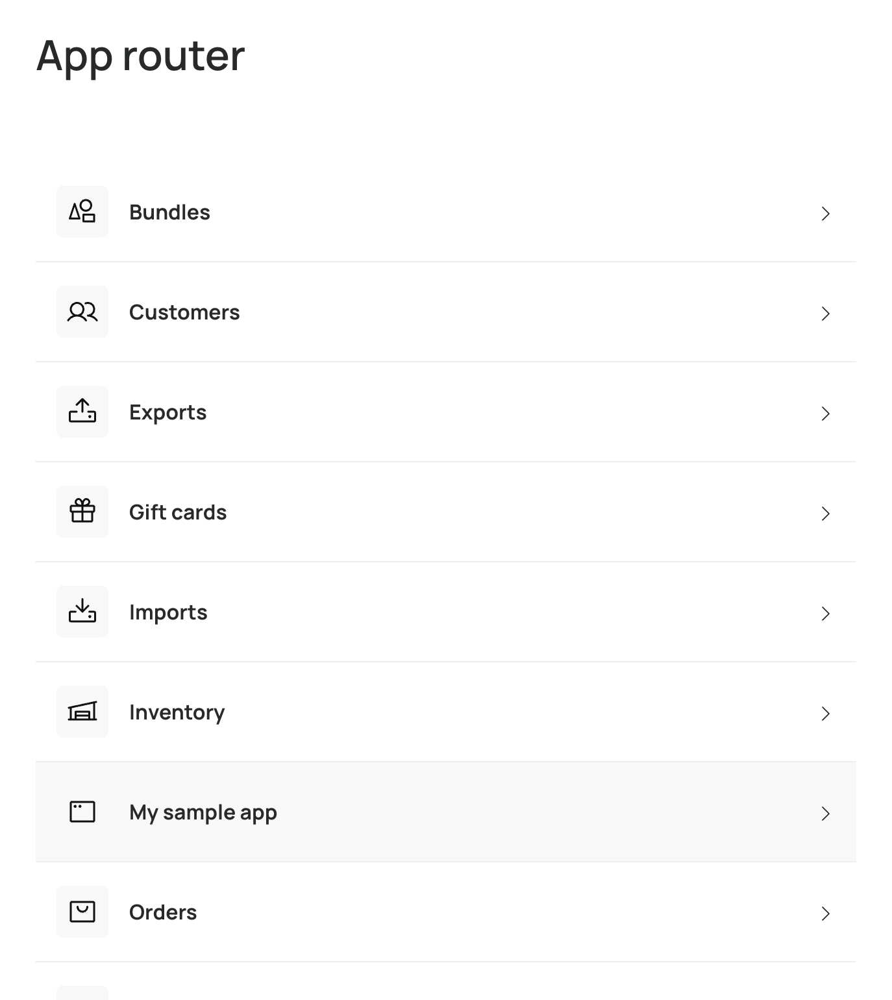

# Creating a New Application

To create a new application, you have two options:

1. Start from scratch using the `my_sample_app` template
2. Duplicate an existing application that matches your needs

If you choose to use the `my_sample_app` template, make sure to replace all occurrences of `my_sample_app` with your new application slug.

If you choose to duplicate an existing application, you'll need to update the `kind` property in the `main.tsx` file. For example, if you duplicate the orders app (`apps/orders/src/main.tsx`), you can either keep `kind="orders"` or use `kind="generic"`, depending on your needs.

> [!NOTE]
> The `kind` property defines the [set of permissions](https://commercelayer.github.io/app-elements/?path=/docs/getting-started-applications--docs) for your application. When you create your app in the dashboard, make sure the kind specified in the dashboard matches the kind defined in your application code otherwise you'll get an "unauthorized access" error.


After setting up your application, register it in the `packages/index/src/appList.js` file:

```js
export const apps = {
  ...
  your_app_name: {
    name: 'Your Application Name',
    slug: 'your_app_slug',
    kind: 'generic',
    icon: 'appWindow'  // Choose an appropriate icon
  }
}
```

Once registered, your application will appear in the applications list during local development.


